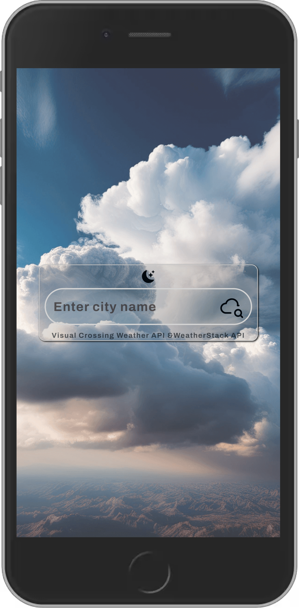
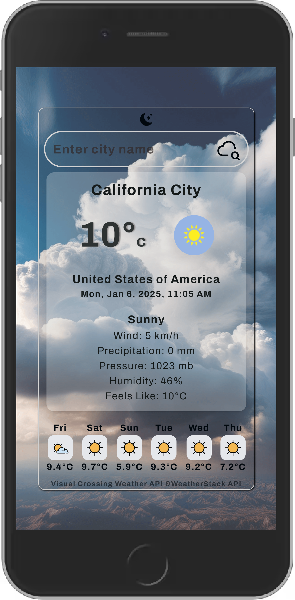
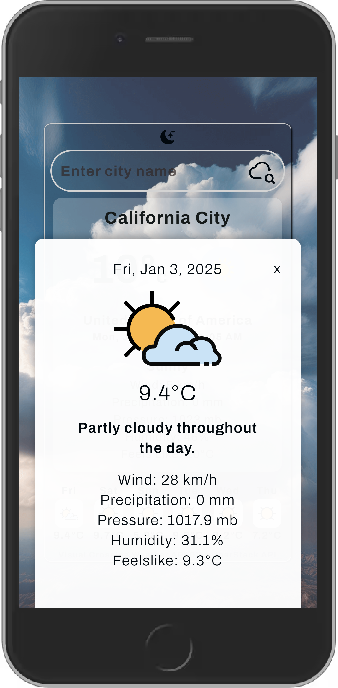
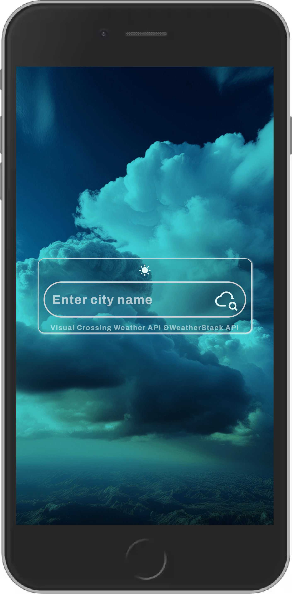
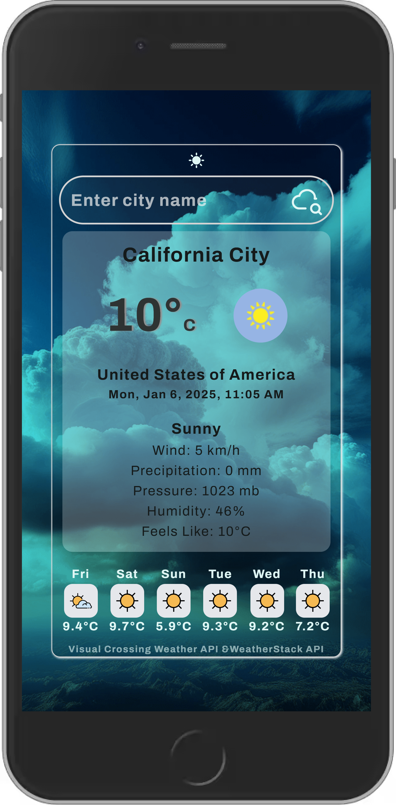
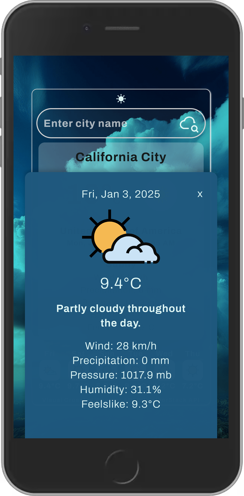

# Vants Weather App

## Contents

- [Description](#description)
- [Features](#features) 
- [Output](#output) 
- [Installation](#installation) 
- [Usage](#usage)
- [Author Notes](#author-notes)
- [License](#license) 

## Description

This weather app gets weather data from the WeatherStack API and displays current weather for a specific location.
A frontend static site is built with Vite, React Typescript, CSS and TailwindCss.

### Technologies & References

- Vite, React Typescript, CSS, TailwindCSS
- Service Worker for caching data
- WeatherStack API for current weather data
- Visual Crossing API for historical and forecast data


## Features

- Displays Current, History and Forecast weather for location entered.
- Responsive design for mobile and desktop screens.
- Caches data for use offline - Stale While Revalidate caching 
- System preference for dark/light mode & Toggle button
- Search Form - if user enters a country name, it will display a city in that country.
- Offline Notifier - if user is offline, it will display a message.

## Output

<p>



</P>
<p>



</p>

[Live Demo](https://avantenaidoo.github.io/vants_weather_app/)
*located in "gh-pages" branch of this repository*

[Back to Top](#vants-weather-app)

## Installation

1. **Clone the repository and navigate to the Project Directory**:
   ```bash
   git clone https://github.com/yourusername/vants_weather_app.git
   cd weather-app
   ```

2. **Install dependencies**:
    ```bash
    npm install
    ```

3. **Create .env file in the root directory and add your own weather API Keys**:
    ```env
    VITE_WEATHERSTACK_API_KEY=<your-api-key>
    VITE_VISUALCROSSING_API_KEY=<your-api-key>
    ```
    *Replace "your-api-key" with your respective API key*

4. **Run the app**:
    ```bash
    npm run dev
    ```
[Back to Top](#vants-weather-app)

## Usage

- Navigate to your browser and follow the link provided at Installation step 4.
- Enter a city name to view current & history/forecast weather conditions.

### How to get your WeatherStack & Visual Crossing API Keys
*Free tier is available for both APIs*

- Head to the [WeatherStack API](https://weatherstack.com/signup/free) site and sign up.
- Head to the [Visual Crossing API](https://www.visualcrossing.com/weather-api) site and sign up.

## Author Notes

- Live Demo may not have renewed or valid API Key 
- Background Image created in Adobe Express. 
- Design and color/colours - inspiration from Tamz & Rob 🕊️. Favicon is personal design from scuba diving ...
- App is still being improved from time to time, please feel free to contribute and/share insights.
- some files are not being used, but kept for reference.

[Back to Top](#vants-weather-app)


## License

[](LICENSE)